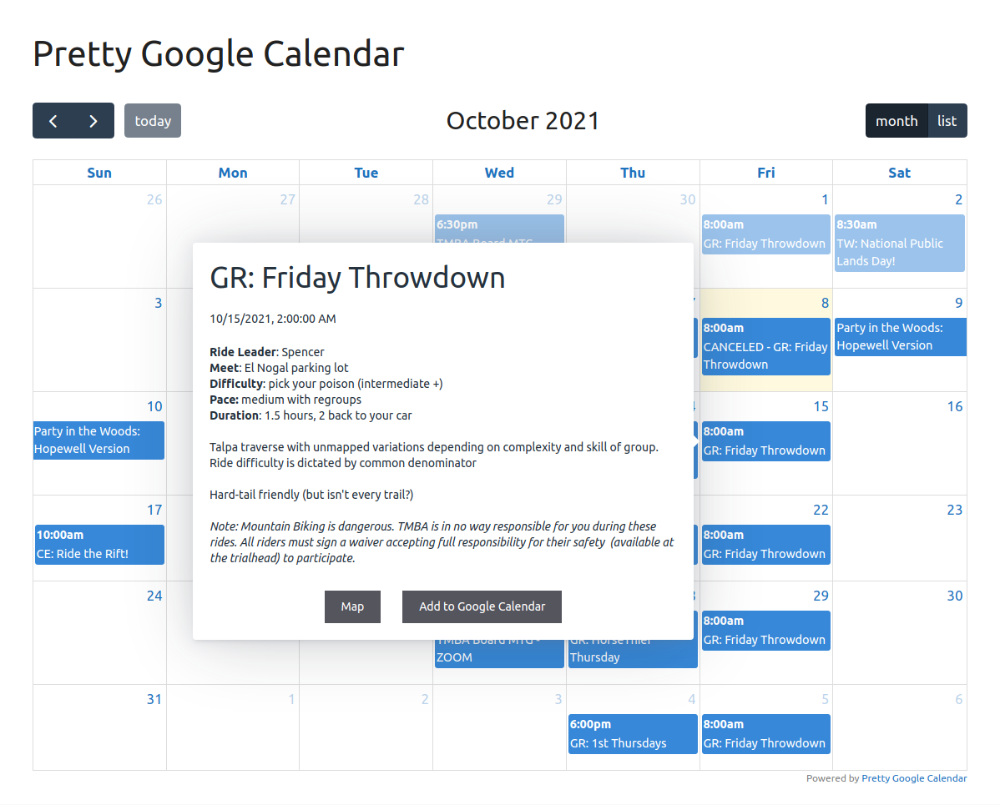

# Pretty Google Calendar

**Contributors:** LBell \
**Donate link:** https://github.com/sponsors/lbell \
**Tags:** calendar, google calendar, fullcalendar, gcal, pretty calendar \
**Requires at least:** 3.0 \
**Tested up to:** 6.9 \
**Stable tag:** 2.0.3 \
**License:** GPLv2 or later \
**License URI:** http://www.gnu.org/licenses/gpl-2.0.html

Embedded Google Calendars that don't suck.

## Description

**You:** I just want to embed a Google Calendar in my WordPress site. \
**Google:** Here's a special kind of ugly! \
**Pretty Google Calendar:** I got this.

This is a light and simple to use plugin that embeds Google Calendars in your website with style, beauty and grace.

Highlights:

- Out of the box support for Calendar grid and agenda list view (and most other FullCalendar views)
- Responsive design switches to list view on smaller screens
- List view customizable to day, week, month, year or custom number of days

How it works:

1. Continue to manage events using Google Calendar as you've always done.
1. Add a shortcode to your page.
1. Sigh with relief.
1. That's it.

## Installation

1. Upload the `pretty-google-calendar` folder to the `/wp-content/plugins/` directory.
1. Activate `Pretty Google Calendar` through the 'Plugins' menu in WordPress dashboard.
1. Obtain your Google Calendar API key (see below)
1. Add the API key to Settings -> Pretty Google Calendar Settings
1. Use the shortcode `[pretty_google_calendar gcal="calendarID@group.calendar.google.com"]` directly in your page or post content.

### Shortcode Options

`gcal="CalendarID,CalendarID"`\
Calendar ID of the desired google calendar (note: must be set to 'Make available to public'. To display multiple calendars, separate ID's by a comma. (Note: calendars must fall under same API access.))

`locale="en"` \
Sets the locale for calendar. Defaults to "en".

`list_type="listCustom"` \
Sets the list type. Options: `listDay`, `listWeek`, `listMonth`, `listYear`, and `listCustom`. (Also accepts day, week, month, year, and custom).
Defaults to `listCustom` for backward compatibility.

Note: `listCustom` allows you to set the number of days you want to display from the current date. Whereas listMonth shows all the events from this month (including past events), `list_type="custom" custom_days="28"` will show the next 28 days
across months.

`custom_days="28"` \
Sets the number of days to show in the list tab. Defaults to 28. Only used with listCustom.

`custom_list_button="list"` \
Sets the label for the listCustom button. Defaults to "list".

`views="dayGridMonth, listCustom"` \
Sets the view types available. If only one view is provided, no view switch buttons will be shown. Defaults to `dayGridMonth, listCustom`.

`initial_view="dayGridMonth"` \
Sets the default view to be displayed when opening the page. Defaults to `dayGridMonth`.

`enforce_listview_on_mobile="true"` \
Sets the change to the list view behavior on small screens. Options: `true` and `false`. Defaults to `true`. This option has no effect if there is no list view declared in the `views` option.

`show_today_button="true"` \
Sets the visibility of the `Today` button. Options: `true` and `false`. Defaults to `true`.

`show_title="true"` \
Sets the visibility of the calendar `title`. Options: `true` and `false`. Defaults to `true`.

`id_hash=random` \
Sets the ID hash for a calendar. If you have multiple calendars on a page and need to style them, you can set this to a permanent code. Otherwise, it'll randomly generate each load. (Note: as of v2.0.0 this can only be alphanumeric.)

`use_tooltip="true"` \
Migrating from global setting for individual calendar styling. Whether the floating tooltip for event pops up on click.

`no_link="true"` \
Migrating from global setting for individual calendar styling. Whether to disable link to calendar.google.com on click.

`fc_args` = JSON string ((EXPERIMENTAL)) \
Allows you to override or impliment just about any FullCalendar argument (with some exception). For example: `fc_args='{"weekNumbers":"true", "eventTextColor":"red"}'`

Note: any argument that contains `[]` will fail due to Wordpress' parsing of shortcodes. No workaround currently.
Note: this is experimental - things may break.

### Styling Multiple Calendars

As of v1.7.0, each calendar gets it's own CSS selector: `pgcal-event-#` where the # is the order of the listed calendar (starting with 0). So if you have two calendars in one, you can use `pgcal-event-0` to style the first, and `pgcal-event-1` to style the second calendar.

### Obtaining Google Calendar API Key

1. The good folks at WPBeginner have a comprehensive writeup: https://www.wpbeginner.com/plugins/how-to-add-google-calendar-in-wordpress/

(Although in the API Restrictions Section, you may need "Don't Restrict Key" selected. YMMV.)

Make your Google Calendar public:

1. In the Google Calendar interface, locate the “My calendars” area on the left.
1. Hover over the calendar you need and click the downward arrow.
1. A menu will appear. Click “Share this Calendar”.
1. Check “Make this calendar public”.
1. Make sure “Share only my free/busy information” is unchecked.
1. Click “Save”.

Obtain your Google Calendar’s ID:

1. In the Google Calendar interface, locate the “My calendars” area on the left.
1. Hover over the calendar you need and click the downward arrow.
1. A menu will appear. Click “Calendar settings”.
1. In the “Calendar Address” section of the screen, you will see your Calendar ID. It will look something like “abcd1234@group.calendar.google.com” this is the value you enter into the shortcode.

## Screenshots

1. Pretty Google Calendar.

   
&nbsp;
&nbsp;

2. List View.

   
&nbsp;
&nbsp;

3. Optional Event Popover.

   
&nbsp;
&nbsp;

4. Settings page. It's that simple.

   
&nbsp;
&nbsp;

## Frequently Asked Questions

### What sorcery is this?!

Pretty Google Calendar impliments the excellent [Full Calendar](https://fullcalendar.io/) for you, and tosses in a little [Tippy.js](https://atomiks.github.io/tippyjs/) and [Popper](https://popper.js.org/) to make things... well... pop.

### Can I use this to manage a calendar?

No. All calendar events are maintaned via Google Calendar, this plugin just displays them in a non-shitty way.

### How do I theme the calendar?

Add custom css to your theme to tweak to your desire.

### Can this plugin do X,Y or Z?

Probably not. But it maybe could!

Pretty Google Calendar is purposefully simple and easy, set up with a few defaults to make things just work. However, there may be a killer feature you want that others are clammering for.

Since it is based on Full Calendar, theoretically, anything that is possible there is possible here. Contact me for requests for additional functionality, and let's see what we can create together!

## Changelog
### 2.0.3

- Fixed: Better list args parsing (Fixes #57)
- Fixed: Removed hardcoded timezone argument for correct local time display. Override with `fc_args='{"timeZone":"###"}'` if needed.
- Fixed: Admin CSS versioning
- Fixed: Sanitization of Google API key in admin
- Improved: id_hash generation

### 2.0.2

- Fixed: Prevent unauthorized disclosure of the Google API (CVE-2025-12898)

### 2.0.1

- Tested: WordPress 6.9

### 2.0.0

- Fixed: XSS vulnerability (required elevate privileges, not likely to be exploited). May break CSS for folks using the `id_hash` shortcode argument.
- Tested: WordPress 6.5.2

### 1.7.2

- Tested: WordPress 6.4.3
- Security fix

### 1.7.1

- Fixed: full FullCalendar locale support
- Updated: FC Google Calendar to 6.1.10

### 1.7.0

- Tested: WordPress 6.4.2
- Added: (Almost) full implimentation of FullCalendar args (see Shortcode Options)
- Added: Colors for multiple calendars in one
- Fixed: Removed view restrictions
- Update: FullCalendar to v6.1.9
- Update: Tippy.js to 6.3.7
- Update: Popper.js to 2.11.8

### 1.6.2

- Fixed: Broken table margin

### 1.6.1

- Fixed: Arg parsing in shortcode

### 1.6.0

- Added: Multiple calendars on one page
- Added: use_tooltip shortcode arg for calendar specific options
- Added: no_link shortcode arg for calendar speficic options
- Fixed: Security fixes

### 1.5.1

- Fixed: Better parsing of urls to accomodate existing <a> tags

### 1.5.0

- Tested to WordPress 6.3.1
- Added: End times in details popup
- Added: Location under time in popup
- Added: Shortcode instructions link to settings page
- Fixed: URLs in descriptions are now parsed
- Fixed: Remove seconds on pop-up time

### 1.4.1

- Fixed: localization text domain

### 1.4.0

- Added: support for multiple calendars displayed in one
- Added: full internationalization (Thanks @mwguerra!)
- Added: new shortcode parameters (view, initial_view, enforce_listview_on_mobile, show_today_button, show_title) (Heroic work by @mwguerra!)
- Tested to WordPress 6.0.3

### 1.3.1

- Version bump for WP's awkward versioning system

### 1.3.0

- Added: list type switcher
- Added: custom list button label
- Added: locale support

### 1.2.0

- Added: disable link option
- Added: "list_days" shortcode option
- Fixed: timezone on tooltip
- FullCalendar update to v5.11.0
- Tested to WordPress 5.9.3

### 1.1.0

Initial Public Release
