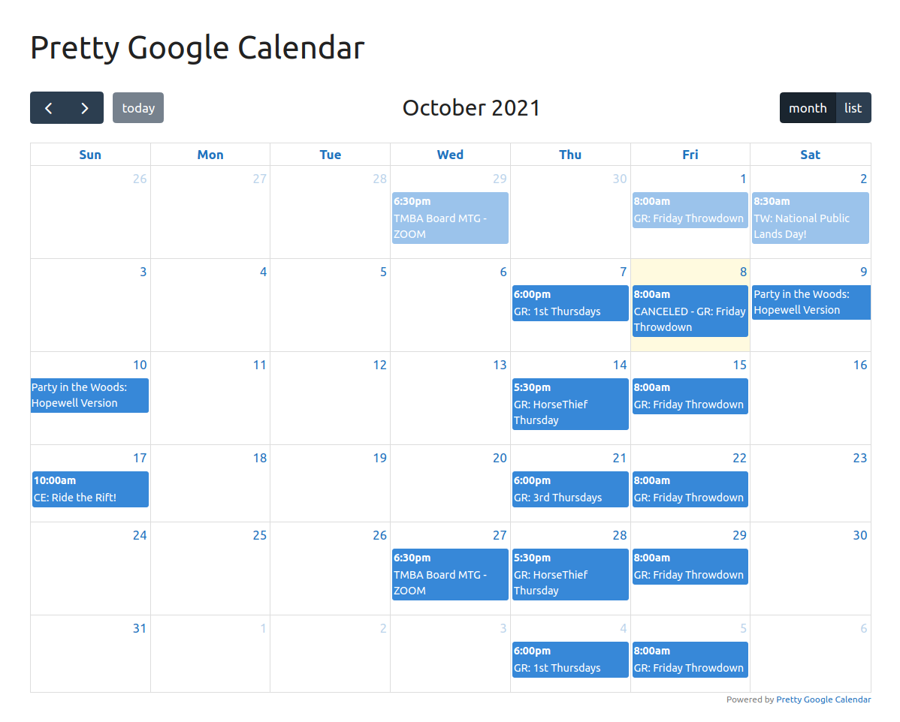
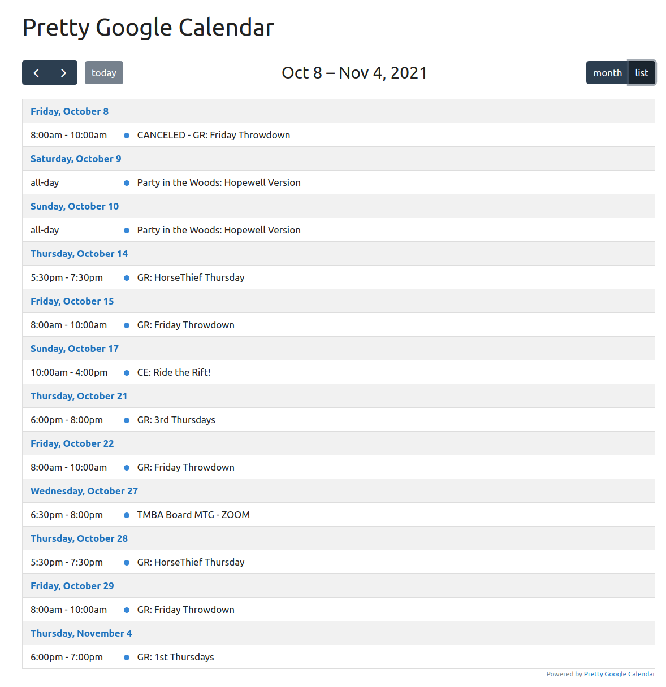
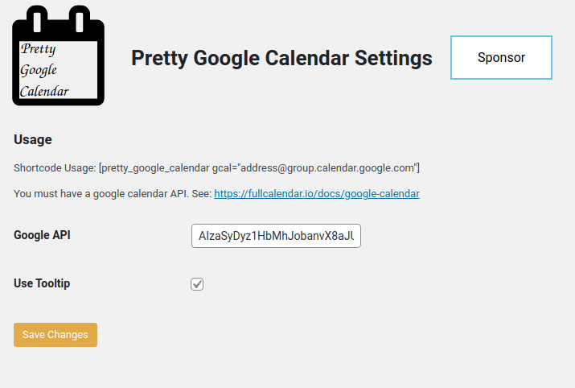

# Pretty Google Calendar

**Contributors:** LBell \
**Donate link:** https://github.com/sponsors/lbell \
**Tags:** calendar, google calendar, events, gcal, cal, fullcalendar, pretty calendar, pretty \
**Requires at least:** 3.0 \
**Tested up to:** 5.8.1 \
**Stable tag:** 1.1.0 \
**License:** GPLv2 or later \
**License URI:** http://www.gnu.org/licenses/gpl-2.0.html

Embedded Google Calendars that don't suck.

## Description

**You:** I just want to embed a Google Calendar in my website. \
**Google:** Here's a special kind of ugly! \
**Pretty Google Calendar:** I got this.

This is a light and simple to use plugin that embed Google Calendars in your website with style, beauty and grace.

How it works:

1. Continue to manage events using Google Calendar as you've always done.
1. Add a shortcode to your page.
1. Sigh with relief.
1. That's it.

## Installation

1. Upload the `pretty-google-calendar` folder to the `/wp-content/plugins/` directory.
1. Activate `Pretty Google Calendar` through the 'Plugins' menu in WordPress dashboard.
1. Obtain your Google Calendar API key (see below)
1. Use the shortcode `[pretty_google_calendar gcal=calendarID@group.calendar.google.com]` directly in your page or post content.

## Obtaining Google Calendar API Key

1. Go to the Google Developer Console and create a new project (it might take a second).
1. Once in the project, go to **APIs & auth > APIs** on the sidebar.
1. Find “Calendar API” in the list and turn it ON.
1. On the sidebar, click **APIs & auth > Credentials**.
1. In the “Public API access” section, click “Create new Key”.
1. Choose “Browser key”.
1. If you know what domains will host your calendar, enter them into the box. Otherwise, leave it blank. You can always change it later.
1. Your new API key will appear. Copy this value into the Pretty Google Calendar settings box.
1. It might take second or two before your API starts working.

Make your Google Calendar public:

1. In the Google Calendar interface, locate the “My calendars” area on the left.
1. Hover over the calendar you need and click the downward arrow.
1. A menu will appear. Click “Share this Calendar”.
1. Check “Make this calendar public”.
1. Make sure “Share only my free/busy information” is unchecked.
1. Click “Save”.

Obtain your Google Calendar’s ID:

1. In the Google Calendar interface, locate the “My calendars” area on the left.
1. Hover over the calendar you need and click the downward arrow.
1. A menu will appear. Click “Calendar settings”.
1. In the “Calendar Address” section of the screen, you will see your Calendar ID. It will look something like “abcd1234@group.calendar.google.com” this is the value you enter into the shortcode.

## Screenshots

1. Pretty Google Calendar.

   
&nbsp;
&nbsp;

2. List View.

   
&nbsp;
&nbsp;

3. Optional Event Popover.

   
&nbsp;
&nbsp;

4. Settings page. It's that simple.

   
&nbsp;
&nbsp;

## Frequently Asked Questions

### What sorcery is this?!

Pretty Google Calendar impliments the excellent [Full Calendar](https://fullcalendar.io/) for you, and tosses in a little [Tippy.js](https://atomiks.github.io/tippyjs/) and [Popper](https://popper.js.org/) to make things... well... pop.

### Can I use this to manage a calendar?

No. All calendar events are maintaned via Google Calendar, this plugin just displays them in a non-shitty way.

### How do I theme the calendar?

Add custom css to your theme to tweak to your desire.

### Can this plugin do X,Y or Z?

Probably not. But it maybe could!

Pretty Google Calendar is purposefully simple and easy, set up with a few defaults to make things just work. However, there may be a killer feature you want that others are clammering for.

Since it is based on Full Calendar, theoretically, anything that is possible there is possible here. Contact me for requests for additional functionality, and let's see what we can create together!

## Changelog

### 1.0.0

Initial Release
